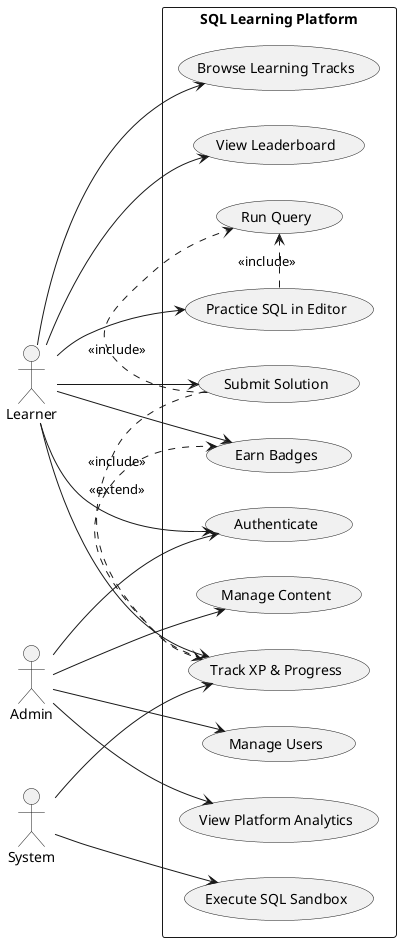
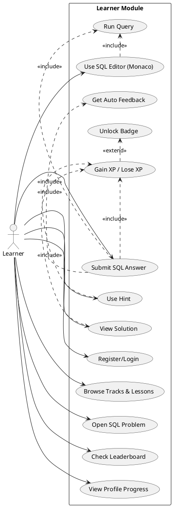
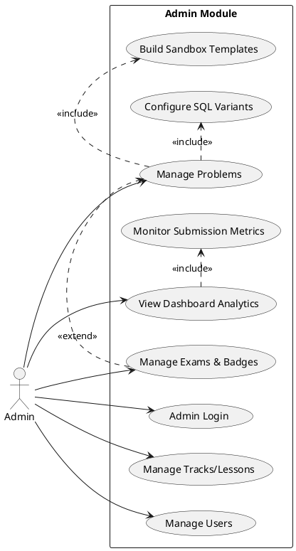
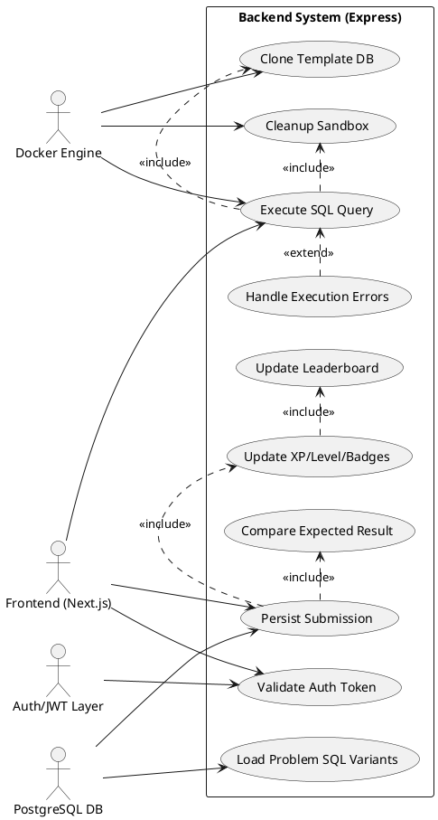

# Chapter 3 — Analysis & Conception: Use Case Diagrams

This section provides four use case diagrams for the SQL Learning Platform in:
- **Textual format** (PlantUML)
- **Visual description format** (actors, relations, preconditions, postconditions)

---

## 2.1 Global Use Case Diagram

### PlantUML

### Visual Description
- **Actors:** Learner, Admin, System
- **Learner capabilities:** authentication, track navigation, SQL practice, submission, progress/XP, leaderboard, badges
- **Admin capabilities:** content management, user management, analytics
- **System capabilities:** sandbox execution and automatic progress recalculation
- **Key relations:**
  - `Practice SQL in Editor` **includes** `Run Query`
  - `Submit Solution` **includes** `Run Query` and `Track XP & Progress`
  - `Earn Badges` **extends** `Track XP & Progress`

**Preconditions**
- Platform is available and backend services are running.
- User has an account for authenticated actions.

**Postconditions**
- User activity is persisted (submissions/progress where relevant).
- System updates XP, leaderboard, and badge eligibility when conditions are met.

---

## 2.2 Learner Use Case Diagram

### PlantUML

### Visual Description
- **Primary actor:** Learner
- **Core flow:** learner opens a problem, writes SQL in Monaco editor, runs query, submits, receives feedback, and gets XP/badges
- **Gamification integration:** hints and solution viewing apply XP penalties; successful submissions increase XP and can trigger badges
- **Progress visibility:** learner views profile progression and leaderboard ranking

**Preconditions**
- Learner is authenticated.
- Target track/lesson/problem exists and is accessible.

**Postconditions**
- Submission and feedback are recorded.
- XP/level/badges/leaderboard state is updated based on result.

---

## 2.3 Admin Use Case Diagram

### PlantUML

### Visual Description
- **Primary actor:** Admin
- **Content domain:** CRUD over tracks, lessons, SQL problems, exams, badges
- **Operational domain:** user moderation and platform analytics
- **Automation relation:** saving/updating problems includes SQL variant configuration and template build for fast learner execution

**Preconditions**
- Admin is authenticated and has admin role.
- Required platform services (database/executor) are online.

**Postconditions**
- Learning content and platform configuration are persisted.
- User/account/status changes and analytics views are updated.

---

## 2.4 System Use Case Diagram

### PlantUML

### Visual Description
- **Technical actors:** Frontend (Next.js), Docker Engine, PostgreSQL DB, Auth/JWT layer
- **Execution pipeline:** token validation → load SQL variants → clone sandbox template → execute query → compare output (for submissions) → persist result → update XP/badges/leaderboard → cleanup sandbox
- **Error behavior:** execution and container/runtime failures are handled by dedicated error handling flow that extends execution behavior

**Preconditions**
- Auth secret, DB connection, and Docker services are available.
- Problem templates/sql variants exist for selected dialect.

**Postconditions**
- Query execution result is returned to frontend.
- Submission lifecycle is fully persisted and sandbox resources are cleaned up.

